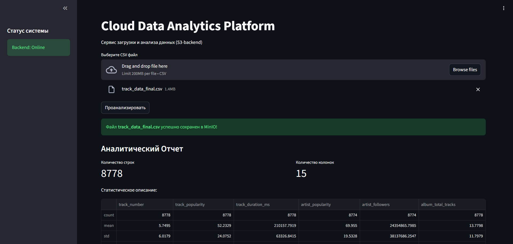

# Cloud Data Analytics Platform

Облачная платформа для автоматизированного анализа CSV-файлов с использованием микросервисной архитектуры. Проект позволяет загружать данные в защищенное S3-хранилище и мгновенно получать статистический отчет.



## Архитектура системы

Проект разделен на независимые контейнеры.

* **Frontend (Streamlit):** Веб-интерфейс для взаимодействия с пользователем.
* **Backend Gateway (FastAPI):** Обрабатывает API-запросы, управляет загрузкой файлов и координирует работу других сервисов.
* **Analytics Service (FastAPI + Pandas):** Изолированный сервис для аналитики.
* **MinIO:** Объектное хранилище.


## Технологический стек

* **Язык:** Python 3.14
* **API:** FastAPI, HTTPX
* **Анализ данных:** Pandas
* **UI:** Streamlit
* **Хранилище:** MinIO (S3)
* **Оркестрация:** Docker, Docker Compose
* **Облако:** Selectel (Ubuntu VPS)

## Развертывание 

### 1. Требования
* Установленный [Docker](https://docs.docker.com/get-docker/) и [Docker Compose](https://docs.docker.com/compose/install/).

### 2. Настройка окружения
Склонируйте репозиторий и создайте файл `.env` в корневой папке:

```bash
git clone [https://github.com/Artarcadman/Cloud_analysis.git](https://github.com/Artarcadman/Cloud_analysis.git)
cd Cloud_analysis
touch .env
```
Содержимое .env файла:

```bash
MINIO_ROOT_USER=minioadmin
MINIO_ROOT_PASSWORD=minio_secret_password
MINIO_DEFAULT_BUCKET=datasets
ANALYTICS_URL=http://analytics:8001
# Укажите ваш IP для доступа к бэкенду из браузера
BACKEND_URL=http://your_server_ip:8000
```


Команда дял запуска:

```bash
docker compose up -d --build
```


После запуска сервисы будут доступны по адресам:

* Frontend: http://localhost:8501
* MinIO UI: http://localhost:9001
* Backend API Docs: http://localhost:8000/docs